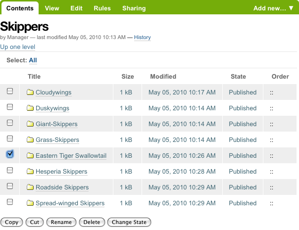

Cancellare contenuti
===================

I contenuti possono essere eliminati da una cartella con facilità.

A volte è necessario eliminare un contentuto, solitamente per sostituirlo con una sua versione aggiornata.
Oppure potresti semplicemente voler eliminare un contenuto, per vari motivi.
Nell'esempio della farfalla swallowtail butterfly erroneamente inserita nella cartella delle farfalle Skippers,
invece di tagliare e incollare il contenuto da qualche parte, potremmo semplicemente eliminarlo:

Nell'esempio riportato sopra, la cartella Eastern Tiger Swallowtail verrà cancellata
dopo aver fatto clic sul pulsante Elimina.

Intere cartelle possono essere eliminate, quindi bisognerà prestare molta attenzione con questa operazione,
ma questo accade anche durante l'uso del computer in generale,
e tutti noi abbiamo imparato a fare dei controlli last-minute per essere sicuri di eseguire l'operazione di cancellazione.

