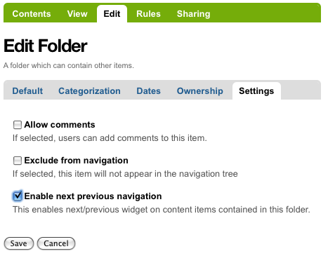
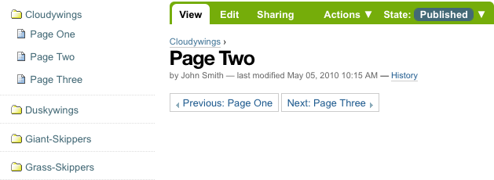

.. _rst_prev-next-links:

Navigazione Precedente - Successivo
==========================

La navigazione automatica Precedente-Successivo per gli elementi contenuti in una cartella
può  essere abilitata nel pannello *Modifica* che troviamo nella scheda *Impostazioni* della relativa cartella.
Qui troviamo una check-box per abilitare la navigazione Precedente-Successivo:

Una volta abilitata, quando gli elementi vengono aggiunti alla cartella,
i collegamenti precedente e successivo verranno visualizzati automaticamente in base alle esigenze:

Sono state create tre pagine all'interno della cartella Cloudywings, e "Pagina Due"
(che non ha testo, per questo esempio) è stata cliccata.
Nella parte inferiore della "Pagina Due" sono i link per "Precedente: Page Uno" e "Successivo: Pagina Tre."

Questa è una caratteristica *veramente* molto utile!

